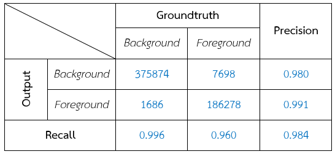
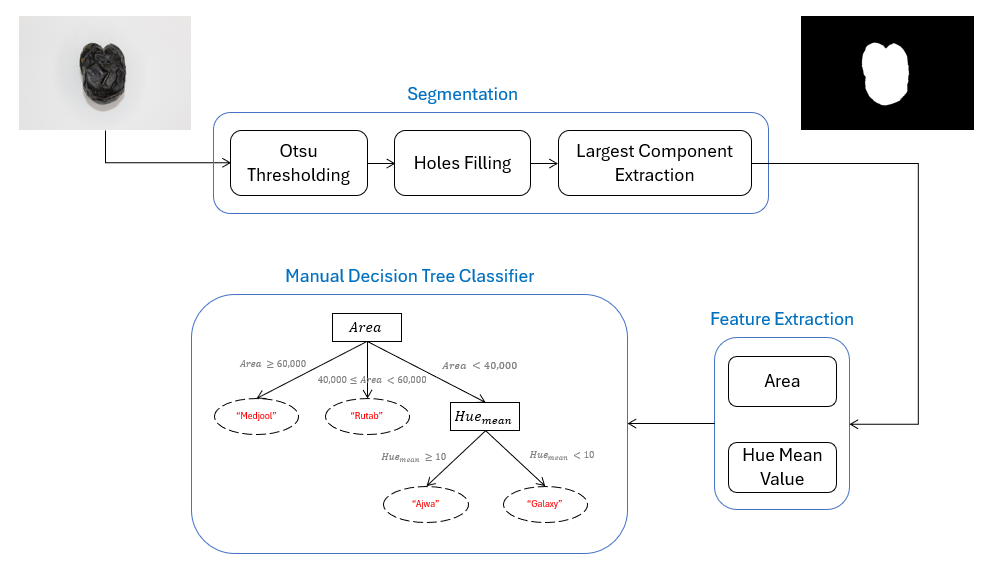
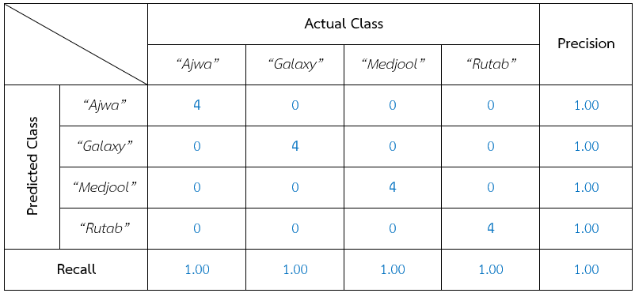

# DIP2024: Answer Examination (Example)

## Datasets

* Stingray Images from https://zenodo.org/records/6475675 
* Date Fruit Images from https://www.kaggle.com/datasets/wadhasnalhamdan/date-fruit-image-dataset-in-controlled-environment 

## Stringray Segmentation

  

### Average Confusion Matrix

  

## Date Fruit Classification

  

### Average Confusion Matrix

  

